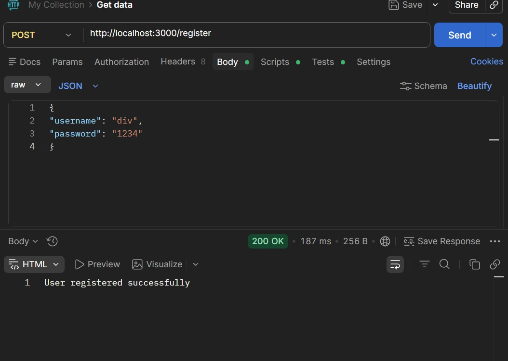
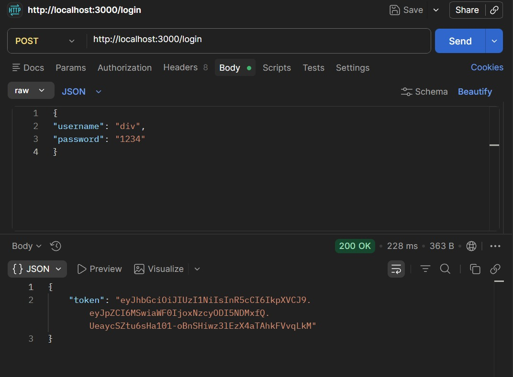
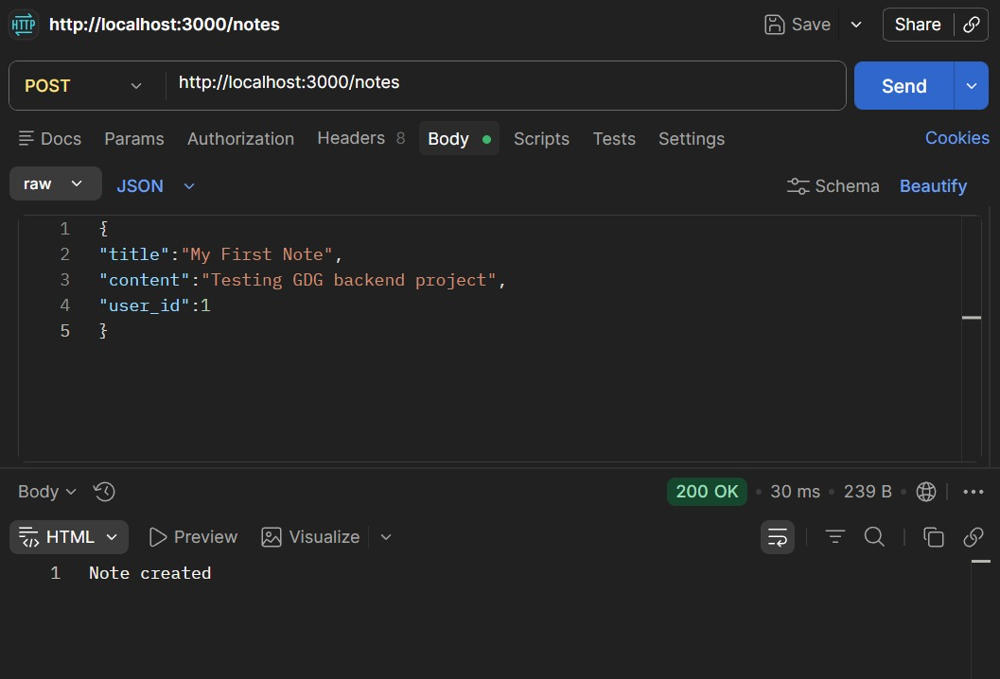
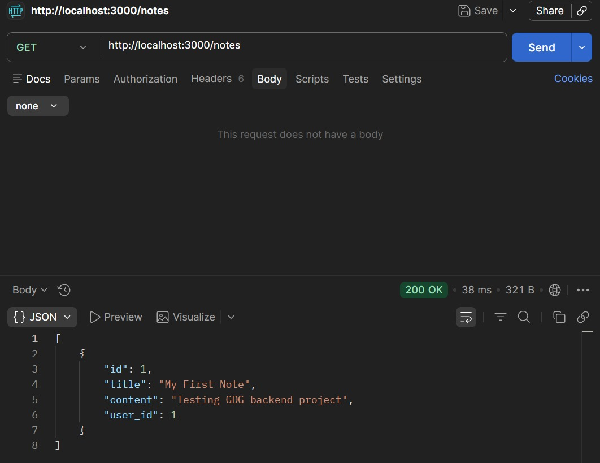
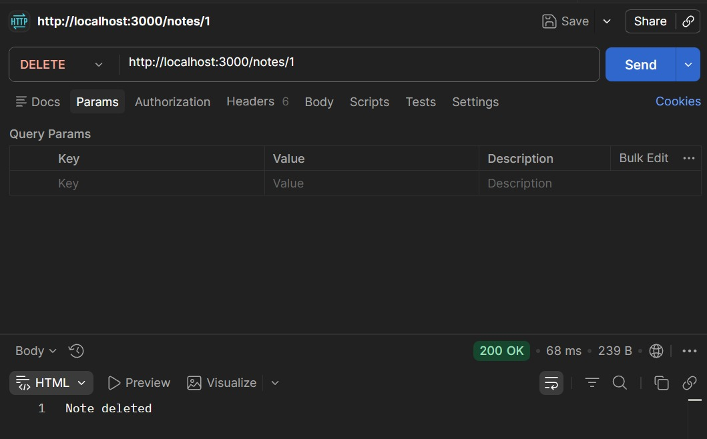

# Notes Management API

A backend API for managing personal notes with authentication using Node.js and Express.

## Features
- User Registration
- User Login with JWT
- Create Notes
- Get Notes
- Delete Notes

## Tech Stack
- Node.js
- Express.js
- SQLite
- JWT
- bcrypt

## API Endpoints

POST /register  
POST /login  
POST /notes  
GET /notes  
DELETE /notes/:id  

## Testing
APIs were tested using Postman.

## API Testing (Postman)

### Register API

### Login API

### Create Note

### Get Notes

### Delete Note

